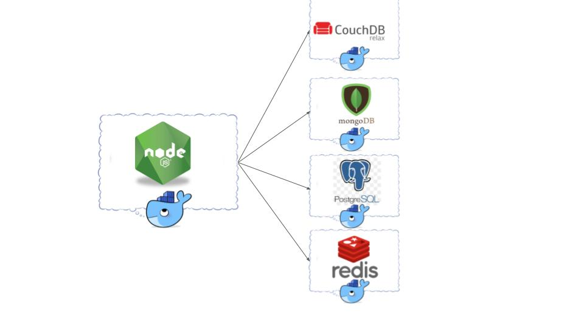
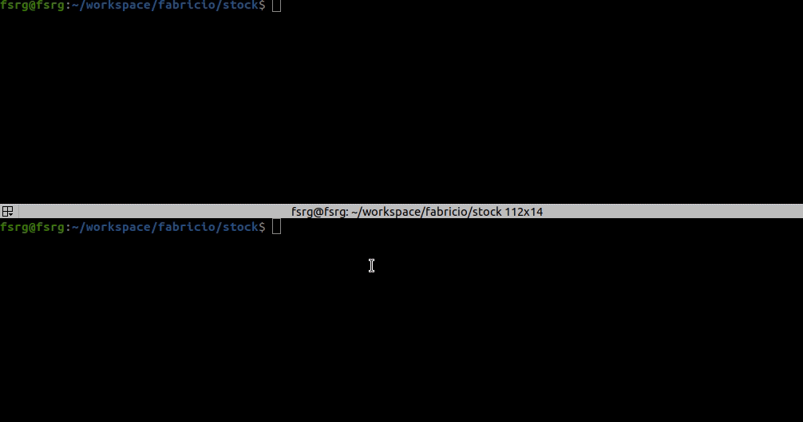
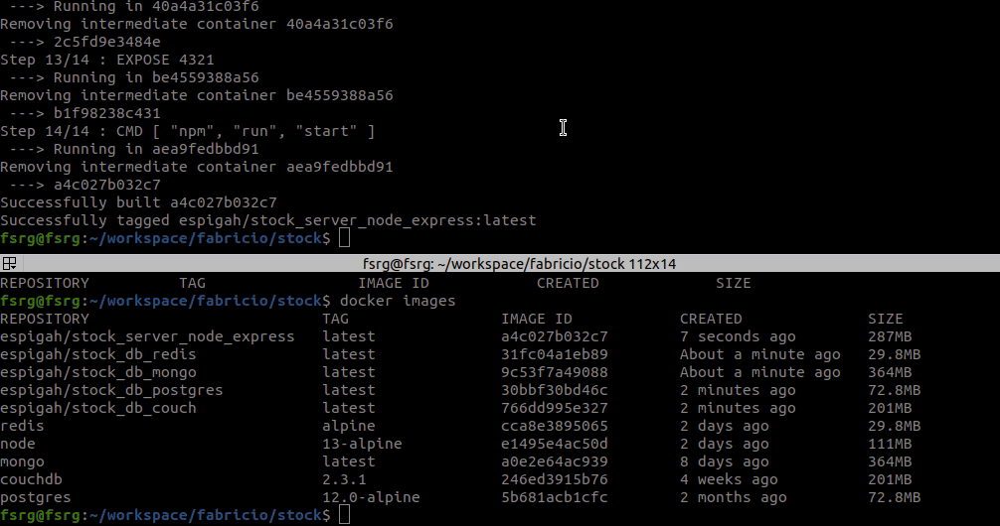
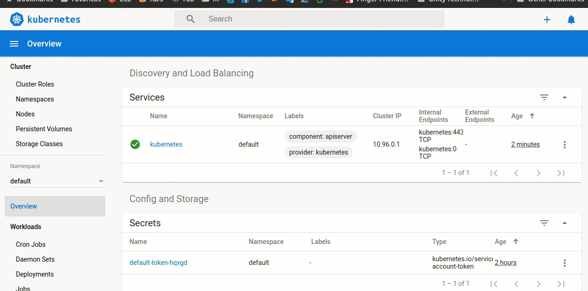

# Purpose

Create a minimal app with docker-compose and multiple storage destinations

## What the program should do

* <strong>C</strong>reate products
* <strong>R</strong>ead products
* <strong>U</strong>pdate products
* <strong>D</strong>elete products
* Show products details
* Sale prodcuts

    

# Install dependencies

* [Node](https://nodejs.org/en/download/)
* [Docker](https://docs.docker.com/docker-for-windows/install/)
* [Docker Compose](https://docs.docker.com/compose/install/)
* [Kubectl](https://kubernetes.io/docs/tasks/tools/install-kubectl/)
* [Minikube](https://kubernetes.io/docs/tasks/tools/install-minikube/)

# Running from DOCKER

## Create docker images

    $ make

    

## Start composer

    $ dokcer-composer up

# Running from KUBERNETES

 $ kubectl apply -f couch-service.yaml,mongo-service.yaml,node-express-service.yaml,postgres-service.yaml,redis-service.yaml,couch-deployment.yaml,mongo-deployment.yaml,node-express-deployment.yaml,postgres-deployment.yaml,redis-deployment.yaml

 

# Author

@Name: Fabricio Goncalves (Espigah)

@Twitter: https://twitter.com/espigah

@Linkdin: https://www.linkedin.com/in/fabricio-gon%C3%A7alves-919a4424/

@Git: https://github.com/Espigah

@Blog: https://fabriciogoncalves.com

@email: fsrg@outlook.com

